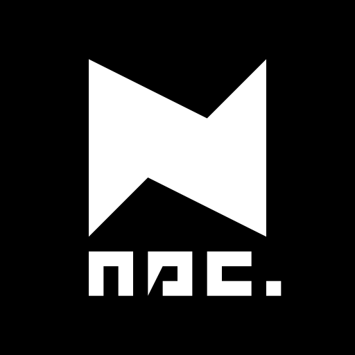

# Ricky Hu 💻
Hi.

## About Me
I study EECS in National Taipei University of Technology, also interested in <EECS>speedcubing</EECS> and <ins>table tennis</ins>.
I am a core member of <ins>NTUT Programming Club</ins>, and also the <ins>DSC Lead</ins> of NTUT.
Being such a newbie in the programming community, I am willing to learn anything that makes me improve.

## My Devices

    
    
    

## Technologies

## Communities

    
    
    

## Github Stats

    
    

### Contacts

